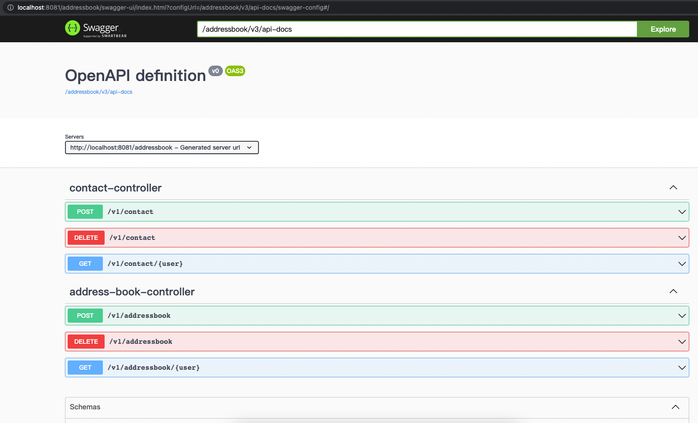

# AddressBook Manager

A simple yet powerful address book and contact manager (Reece.com.au coding challenge).<br>

## Table of contents:

* [Challenge statement](./README.md#Challenge-statement)
* [Acceptance Criteria](./README.md#Acceptance-Criteria)
* [Deliverables](./README.md#Deliverables)
* [Setup](./README.md#Setup)
* [Quality Analysis](./README.md#Quality-Analysis)

## Challenge statement

As a Reece Branch Manager I would like an address book application So that I can keep track of my customer contacts

## Acceptance Criteria

- Address book will hold name and phone numbers of contact entries
- Create a REST API which will have endpoints for the following
    - Users should be able to add new contact entries
    - Users should be able to remove existing contact entries
    - Users should be able to print all contacts in an address book
    - Users should be able to maintain multiple address books
    - Users should be able to print a unique set of all contacts across multiple address books

## Assumptions

- Auth is not required
- User's name is unique to identify a user.
- User can have multiple Addresses; user define the name of each Address Book; the name is unique to identify a
  AddressBook per User.
- API doesn't provide function to edit Address Name.

## Not Implemented Yet

- Callable API & web execution threads
- Managing ThreadPool, timeout (circuit breaker is not require)
- Business error mapping, no custom exception are defined
- Blackbox test, API swagger validation (required CI pipeline to be setup)
- Performance test
    - `@Transactional` tag is in used, need to review if introduce database lock
    - Entity has been designed "double bind" and "EAGER fetch". Need to review in perf load.
    - the concurrent calls are not covered. Duplicated records can happen, that the "name" on either "User" nor "Address
      Book" may not unique. (to avoid such duplication, need to implement centralize lock (i.e database level), but
      might impact performance)
- Dependencies security check is missing

## Deliverables

- API spec would be nice to have
- all acceptance criteria to be demonstrable through tests
- data can be persisted in a storage
- containerise the application using docker

## Setup

1. Make sure you have Java 8 and Docker installed in your machine.
2. Clone git respository
3. Build app, run tests and quality check from command line:

   ```./gradlew clean build```

4. build docker

   ```./gradlew bootBuildImage```

5. Startup testing env (postgres)

   ```./gradlew composeUp```

6. Run App

   ```docker run --rm -it -p 8081:8081 --network=host address-book:latest```

7. Health API

   ``http://localhost:8081/addressbook/actuator``

8. API doc

   ``http://localhost:8081/addressbook/swagger-ui.html``



## Quality Analysis

|Name|Report|
|:----:|:---:|
|Test Summary|```../build/reports/tests/test/index.html```|
|Test Coverage|```../build/reports/tests/coverage/index.html```|
|Checkstyle|```../build/reports/checkstyle/main.html```|
|FindBugs|```../build/reports/findbugs/main.html```|
|PMD|```../build/reports/pmd/main.html```|
